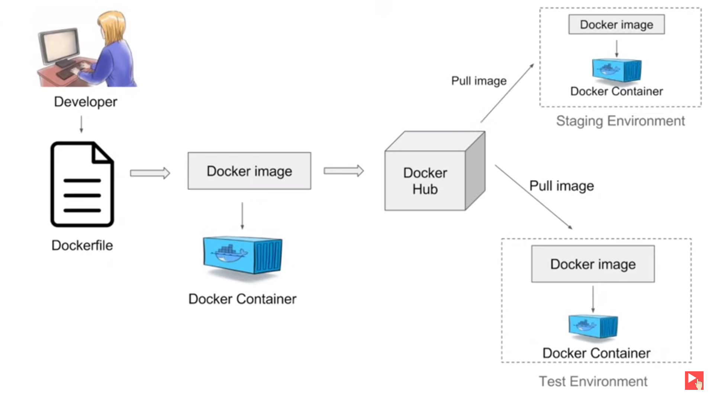
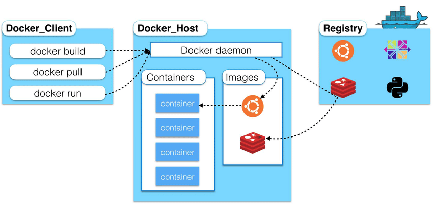

## A Quick Guide on Docker

Docker is a tool that allows developers to easily deploy their applications in container and run on host OS.
Docker enables users to run each component in a seperate container with its own dependencies and libraries.
It allows users to package an applications with all of its dependencies into a standardized unit.


### Why need docker?
Compatibility with the OS can be an issue of various tech stacks.
The matrix from hell: challenge of packaging any application so that it can run on any cloud, regardless of operating systems/hardware/infrastructure.

New developer comes in, its difficult to set up the environment. Developer has to follow large set of instructions. Make sure they are using right OS, right version of different stacks. 

DIfferent developers may be comfortable working on different OS. Docker comes to the rescue, so that the app will run the same way despite of OS.


#### Images
A Docker image is a file used to execute code in a Docker container. Docker images is like a template with set of instructions to create one or more containers. 


#### Container
Docker containers are running instances of images that have completely isolated environment.
They have their own process/services, network interface, mounts, just like Virtual Machines (VM), but they all share same OS kernel. 

Container is a unit for distributing and testing an application.
Containerized application runs the same way everywhere.
Docker container can run on developer's local laptop, on physical or VM in data center, on cloud providers.

### Docker vs Virtual machines


The overhead to manage the container system is very low as compared to VMs.
Each virtual machine(VM) has its guest operating system above the host operating system, which makes virtual machines heavy. While on the other hand, Docker containers share the host operating system, and that is why they are lightweight and boots up in just few seconds.

The virtual machine has strong isolation in the host kernel whereas containers have shared host kernel. In a virtual machine, you don’t get direct access to the resources, and hypervisor is there to restrict the usage of resources in a VM, while in docker resources are shared, so its less secured.

<!--  -->
<center></center> 

Unlike the case of virtual machines, there is no need to allocate resources permanently to containers.

### Docker Architecture
In a docker workflow, developer will define all the application its dependencies and requirements in a file called DockerFile. In docker images, we will have all the applications with its requirements and dependencies. When we run docker image, we get docker container.
Docker images can be stored in online cloud repo called Dockerhub. We can pull any public images and run on our local machine. We can also push images of our 
project to Dockerhub, just like Github.
<!-- 


 -->

<center></center>


Docker has client-server architecture. Daemon (server) receives command from Docker client through CLI or REST APIs.
Docker client and Daemon can be present on same host or different host.
Docker client can communicate with more than one daemon.

Daemon have lots of end points for different works.

<center></center> 

Client pass command to docker host.
Daemon is responsible to accept command from client and perform operations.

We can have multiple containers running from the same image, all sharing same behaviour.
Once the container is created, the execution is managed by container runtime. You can interact with container runtime through "docker" command.


Docker is configured to look for images on dockerhub by default. 


### Docker Commands
docker run: start a container from image (if image is not available in local machine, pulls from dockerhub if exists and runs)
```bash
docker run <image_name>
```

docker ps: lists all running container
```bash
docker ps
```

docker ps -a: lists all running as well as exited (previously run) containers
```bash
docker ps -a
```

docker stop: to stop running container
```bash
docker stop <container_id>
```

docker kill: to stop execution immediately (difference is that stop gives container to shut down gracefully taking time)
```bash
docker kill <container_id>
```

docker remove: removes a container permanently
```bash
docker rm <container_id>
```

docker images: lists the available images in local machine
```bash
docker images
```

docker remove images: removes the images from local machine. Make sure no container is running off of this image (remove all associated containers first)
```bash
docker rmi <image_name>
```

docker pull images: pulls the images from dockerhub and stores in local machine but doesn't run the container unlike (docker run that pulls and runs)
```bash
docker pull <image_name>
```

docker exec: if we want to execute a command on a running container (access/interact with running container) 

#### Detach and Attach

docker run: runs in foreground in attached mode (we will be attached to console and only view output and won't be able to do anything other than view output until docker container stops.)

```bash
docker run -d <image_name>
```
runs the container in background detached mode 

```bash
docker attach <container_id>
```
if we want to attach a running container later

#### Interactive modes
If a container prompts for the username's input. Then,

prompt message: What is your name? \
User input: Kamal

without interactive mode (directly output is show without user's interaction) \
with -i mode (lets user input) \
with -it mode (lets user see prompt message and take input)

```bash
docker run <app>
```
std_out only, non-interactive

```bash
docker run -i <app>
```
to run docker in interactive mode

```bash
docker run -it <app>
```
to run docker in interactive mode with pseudo terminal


#### Port Mapping
Port mapping is done to let other users access our application.
Every docker container gets an IP assigned by default. This internal IP is only accessible within docker host only.
Using IP of docker host users outside docker host can access the application.
For this, we map port inside docker container to port in docker host.

```bash
docker run -p 80:5000 <myapp>
```

all traffic from port 80 dockerhost will be routed to port 5000 docker container


#### Docker Tags
Tags are used in versioning the docker images. 
During project, we keep on changing and update our source code, then build image and publish it.

<image_name>:<tag_name> 

<name_space>/<image_name>:<tag_name>

```bash
docker build -t helloworld:v1.0.0
```

to change tag or add namespace
```bash
docker tag helloworld:v1.0.0 kamalgodar/helloworld:v1.0.1
```

docker login: to authenticate
```bash
docker push <image_with_namespace>
```


### Dockerfile 
Dockerfile is text file written in specific format that Docker can understand.
Dockerfile describes steps to create Docker image. Its like receipe with all ingredients and steps necessary to make dish.

Format: 
```bash
Instruction[CAPS] Argument
```

#### Layered Architecture
When docker builds images, it build these in a layered architecture. Each line of instruction creates a new layer in a docker image with just the changes from previous layer. 

All the layers are cached by docker. In case, if any step fails and we have to re-build, then it re-uses previous layer from cache and continue to build
remaining layer.

To build own image, we create Dockerfile with simple syntax for defining the steps needed to create image and run it.
Each instruction in a Dockerfile creates a layer in the image. When you change Dockerfile and rebuild image, only those layers which have changed are built.
This makes image lightweight, small and fast.


### Docker-Compose
Docker compose runs multiple containers as a system. It is used to set up a complex application running multiple services (containers). Docker compose is for local development. With compose, we configure file in yml format.

```bash
docker-compose up 
```
brings up entire application stack; aggregates the output of each container

```bash
docker-compose down
```
stops and removes containers, networks, images, and volumes